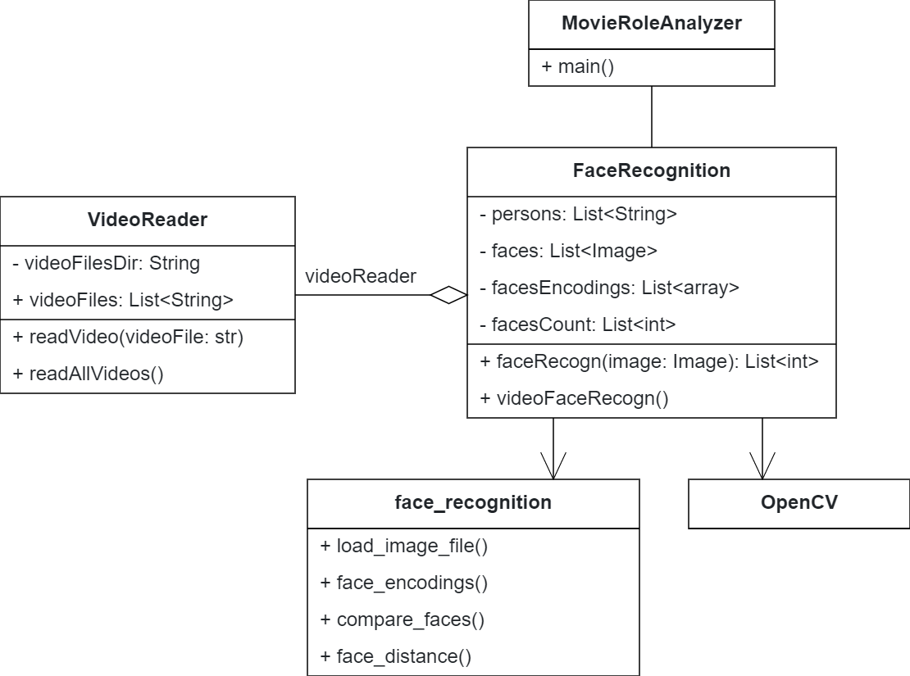

# Movie-Role-Analyzer
This project analyzes the importance of character role in a movie/series/video by applying face recognition frame-wise and output the statistical result of appearance of each role.


## Setup

1. Place the known faces of persons inside `/persons` directory. Multiple faces from the same person is supported (and encouraged in order to decrease uncertainty). Therefore each image should be named as `<name>_<number>.png`, e.g. `Kevin_2.png` means the second face of Kevin. 

2. Place the videos inside `/videos` directory. 

3. Create an `FaceRecognition` object and call the `videoFaceRecogn` method as below:

   ```python
   fr = FaceRecognition(personsDir, videosDir)
   fr.videoFaceRecogn(numProcess=4, yieldNum=40, sampleRate=8, k_certainty = k)
   ```

   (See more in the main script `MovieRoleAnalyzer.py`)


 

## Version 1.2.0 



### Features:

1. `VideoReader` for reading frames of each movie in a given directory.

2. `FaceRecognition` for analyzing each frame with the ground truth faces

   

### Problems: 

1. Efficiency: only can process about 1~3 frames per second
2. Accuracy: only frontal faces are recognized
3. What to do if nobody's face is matched?
4. :white_check_mark:Functionality: statistical result visualization at the end
5. Functionality: skip frames at the beginning and end


Accuracy problems:

1. Long Tao get matched with a role -> find ***k*** most similar faces
2. A role gets matched with another role -> ?
3. No (frontal) face detected -> temporal smooth 


### Solutions:

* Efficiency

	1. :white_check_mark:Frame sampling with a sample rate of 3~10 
	2. :white_check_mark:Resolution down-sampling 
	3. :white_check_mark:Parallelize code (e.g. pipelined reader-analyzer, data parallelism) -> speedup = 2 for 4 processes
	4. C++ implementation (version 3.0)
* Accuracy
  1. Unmatched faces (Long Tao) -> idea: find ***k*** most similar faces, if they belong to the same person, then it is not a Long Tao. This also decreases uncertainty.
  2. :white_check_mark:More (repeated) ground truth faces to decrease uncertainty
  3. CNN (version 2.0)
  4. Temporal smoothing

